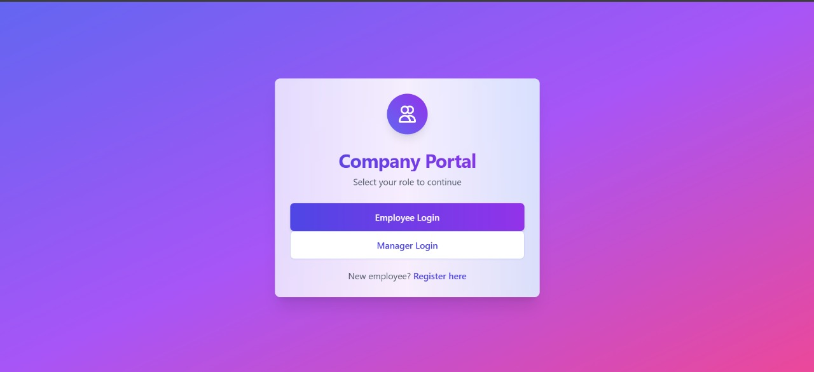
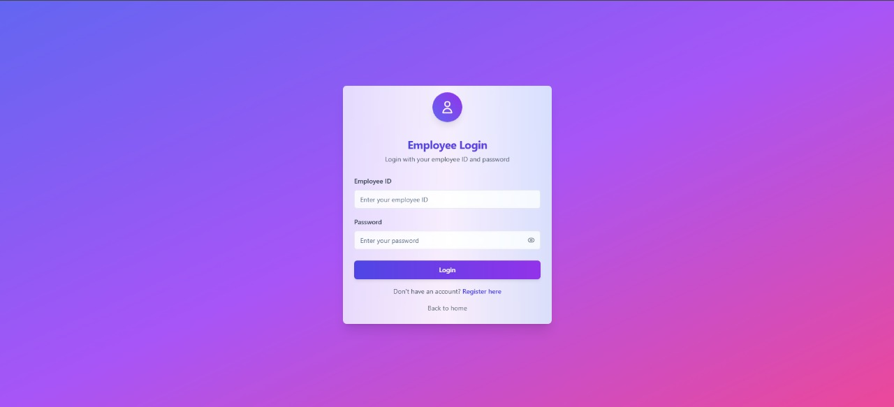
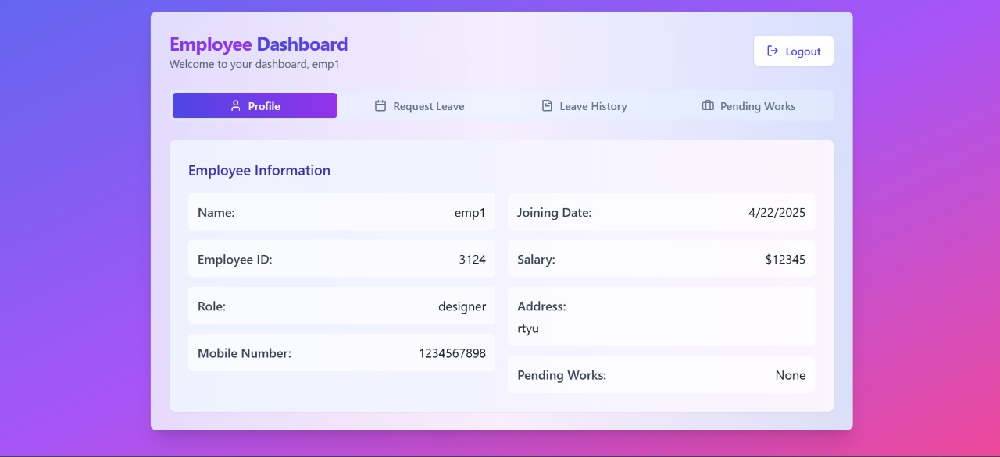
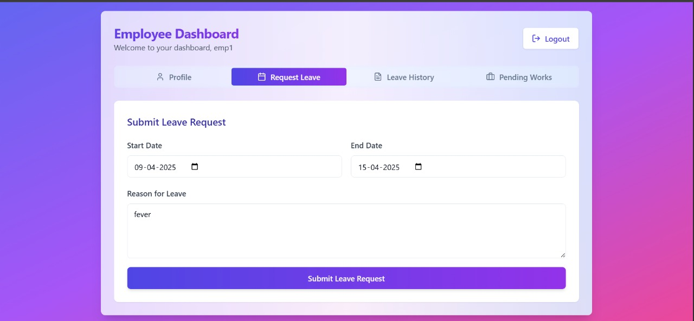
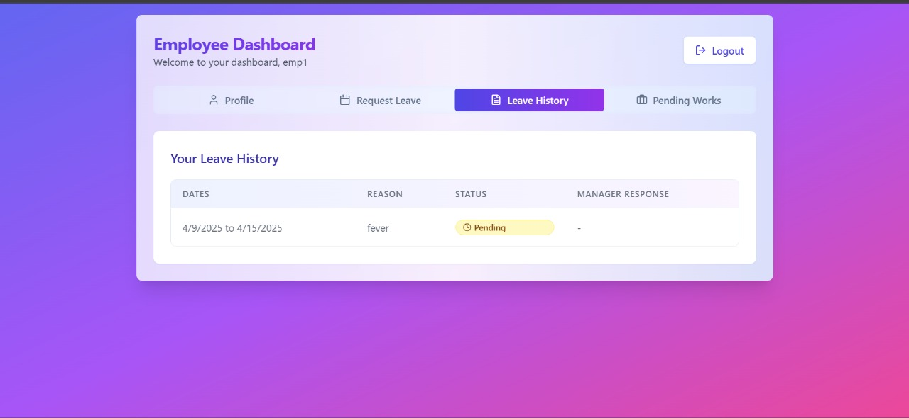
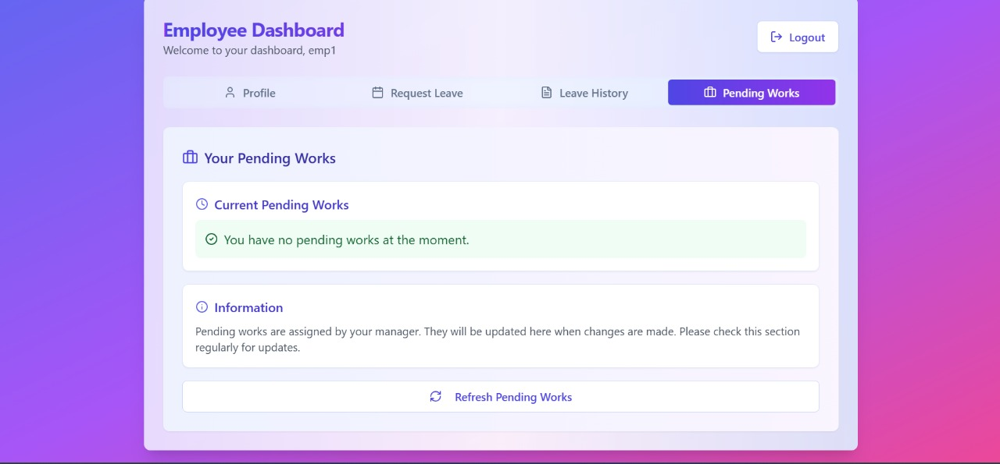
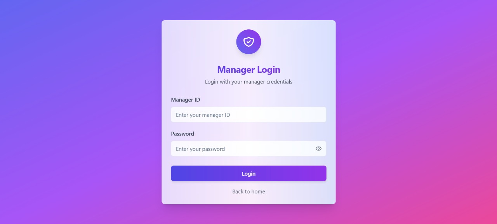
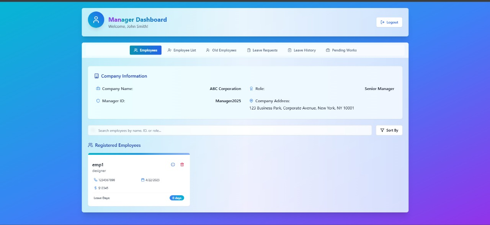
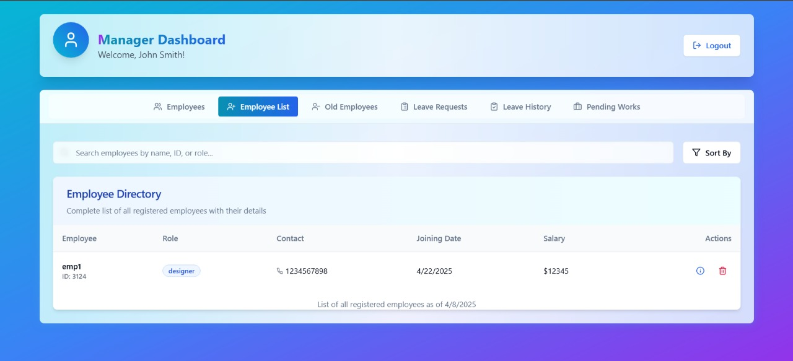

# 👥 EmployeeManagement

The **Employee Management System** is a web-based application designed to simplify and streamline HR operations by providing a centralized platform to manage employee records, roles, and departments efficiently.

## 🖼️ Main Portal

Below is the main portal of the system, where users can log in as an **Employee**, **Manager**, or register a new account:

## 📝 Employee Registration Form

This is the registration form where new users can create an account by providing necessary details such as name, email, department, and password.

## 🔐 Employee Login

This is the login screen for employees. Users can enter their credentials to securely access their dashboard and manage their profile and tasks.

## 📊 Employee Dashboard

Once logged in, employees are directed to their personalized dashboard. Here they can view and manage their details, assigned tasks, attendance, and other relevant information.

## 🗓️ Leave Request Form

Employees can request leaves using this form by specifying the leave type, date range, and reason. The request is then sent to the manager for approval.

## 📅 Leave History

Employees can view their leave history, including dates, leave types, status (approved, pending, rejected), and any remarks from the manager. This helps keep track of all past requests in one place.

## ⏳ Pending Works

This section displays the list of pending tasks assigned to the employee, including task names, deadlines, and priority levels. It helps employees stay on top of their responsibilities and meet deadlines efficiently.

## 🧑‍💼 Manager Login

Managers can log in through a dedicated portal to access features like reviewing leave requests, assigning tasks, and monitoring employee activities.

## 📂 Manager Dashboard

After logging in, managers are directed to their dashboard where they can view employee statistics, manage tasks, approve or reject leave requests, and oversee department performance.

## 📋 Registered Employees

This section provides managers with a comprehensive list of all registered employees, including details like employee ID, name, department, role, and contact information. It helps in efficient employee tracking and management.

