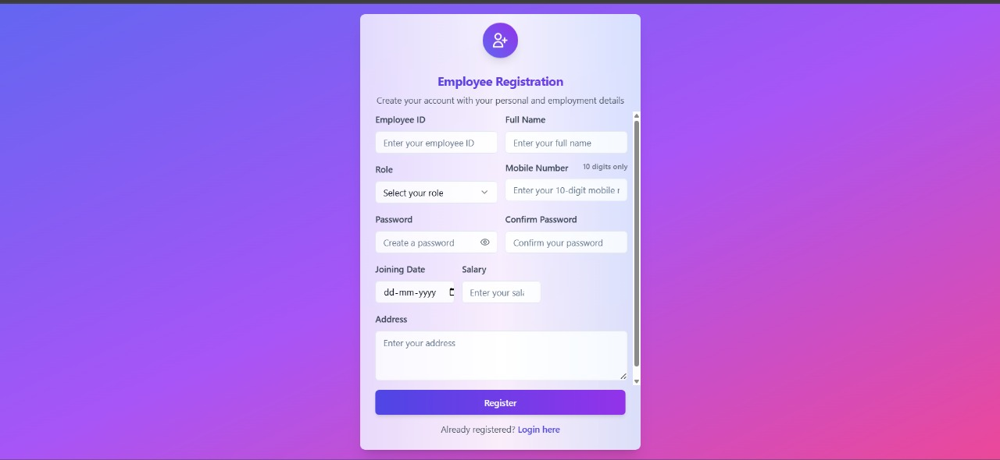
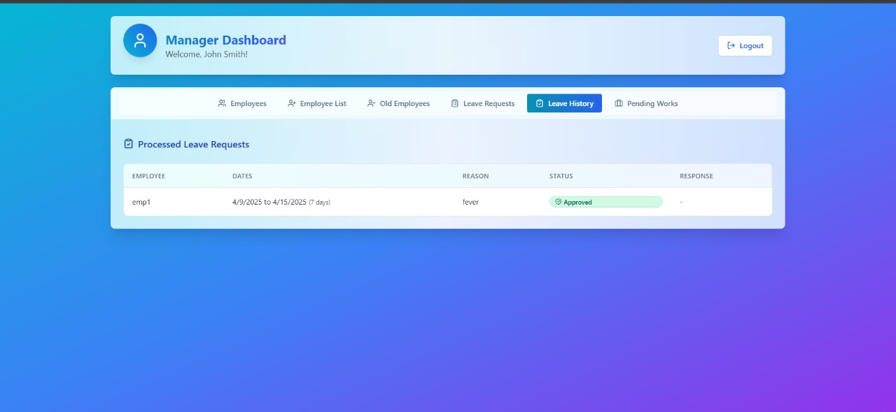

# 👥 EmployeeManagement

The **Employee Management System** is a web-based application designed to simplify and streamline HR operations by providing a centralized platform to manage employee records, roles, and departments efficiently.

## 🌐 Live Demo

Check out the live project here: [EmployeeManagement Website](https://managerworkwise.netlify.app/)

## 🖼️ Main Portal

Below is the main portal of the system, where users can log in as an **Employee**, **Manager**, or register a new account:

## 📝 Employee Registration Form

This is the registration form where new users can create an account by providing necessary details such as name, email, department, and password.

## 🔐 Employee Login

This is the login screen for employees. Users can enter their credentials to securely access their dashboard and manage their profile and tasks.
- Employee can login using their employee id and password.

## 📊 Employee Dashboard

Once logged in, employees are directed to their personalized dashboard. Here they can view and manage their details, assigned tasks, attendance, and other relevant information.

## 🗓️ Leave Request Form

Employees can request leaves using this form by specifying the leave type, date range, and reason. The request is then sent to the manager for approval.

## 📅 Leave History

Employees can view their leave history, including dates, leave types, status (approved, pending, rejected), and any remarks from the manager. This helps keep track of all past requests in one place.

## ⏳ Pending Works

This section displays the list of pending tasks assigned to the employee, including task names, deadlines, and priority levels. It helps employees stay on top of their responsibilities and meet deadlines efficiently.

## 🧑‍💼 Manager Login

Managers can log in through a dedicated portal to access features like reviewing leave requests, assigning tasks, and monitoring employee activities.
- Manager have static credentials: 
    - Manager ID : Manager2025
    - Password : mana@2025

## 📂 Manager Dashboard

After logging in, managers are directed to their dashboard where they can view employee statistics, manage tasks, approve or reject leave requests, and oversee department performance.

## 📋 Registered Employees

This section provides managers with a comprehensive list of all registered employees, including details like employee ID, name, department, role, and contact information. It helps in efficient employee tracking and management.
- Manager can able to see the registered employees.
- Manager can also able to delete the registered employee.
- Once the manager is deleted the employee the complete details of that employee will be removed and the employee was unable to login.

## ✅ Leave Request Tab

In this section, managers can view all pending leave requests submitted by employees. Each request includes details like leave type, date range, reason, and current status. Managers can approve or reject requests directly from this interface.

## 📑 Leave Request History (Manager)

This tab allows managers to view the history of all processed leave requests, including approved, rejected, and pending applications. It provides clear visibility into past actions and helps with decision-making and record-keeping.

## 📝 Work Assignment

Managers can assign tasks to employees through this section by specifying task details like title, description, deadline, and priority. Assigned tasks are tracked and reflected on the employee’s dashboard under pending works.

## ✨ Features

- 🔐 **Role-Based Authentication** – Separate access for Employees and Managers with secure login.
- 🧾 **Detailed Employee Profiles** – Each employee has a complete profile with personal and professional info.
- 🗃️ **Task Tracking** – View and update the status of assigned tasks in real-time.
- 📈 **Dashboard Insights** – Clean and informative dashboards for both employees and managers.
- 📬 **Leave Management Workflow** – Submit, review, approve/reject leave requests with full history.
- 🧭 **Navigation Panel** – Easy-to-use sidebar or navbar for switching between sections.
- 📂 **Organized Codebase** – Clear separation of frontend, backend(localstorage), and assets for easy maintainability.

## 🌐 Live Demo

Check out the live project here: [EmployeeManagement Website](https://managerworkwise.netlify.app/)

